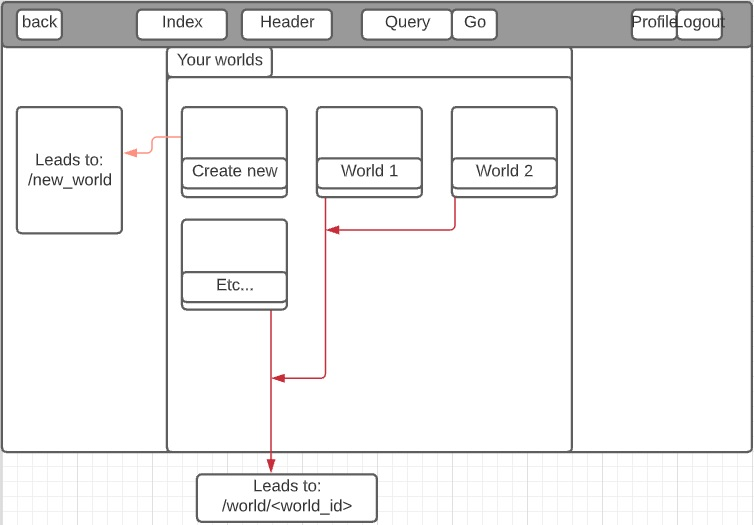
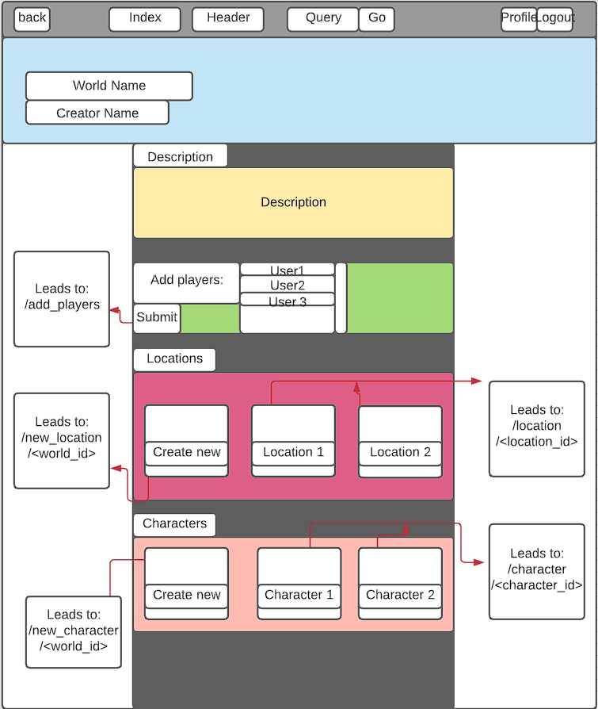
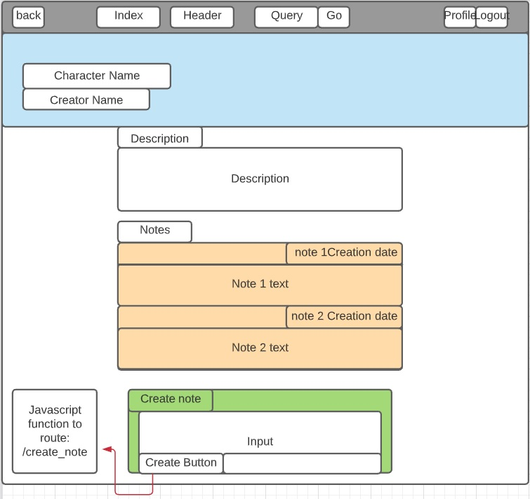
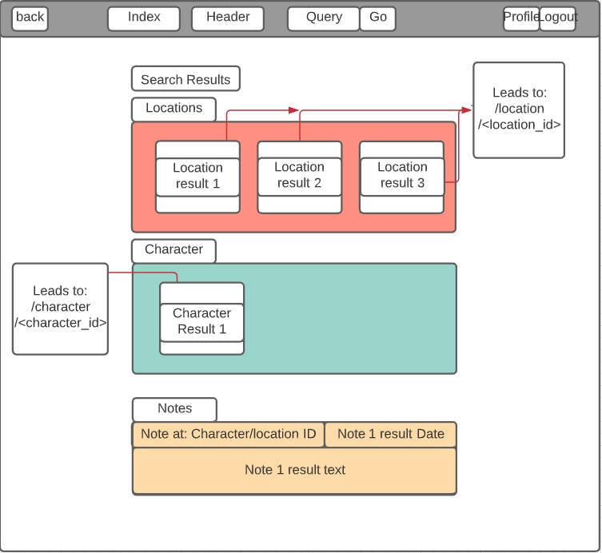
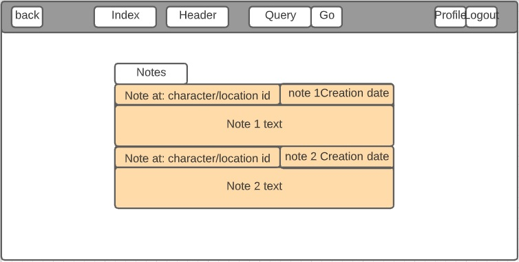
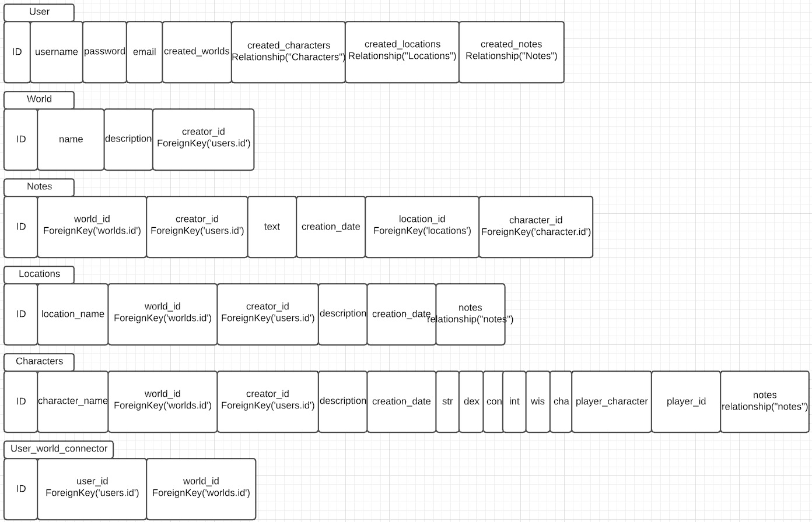

#Design

##Application

Features:
* Register
* Login
* Create World
* Invite Users
* Create Locations
* Create Characters
* Create Notes
* Create Avatar
* View All your notes.

###Homepage
Users are greeted at a homepage where they can direct to their worlds or their userpage.
 

Functions:
The index page contains a list of all worlds the user has created or is connected to. 
These worlds are displayed and link to their respective world page via the route: /world/<world_id>
where <world_id> is their ID. 

###Worldpage
At the world page you can view all worlds you've joined or created.
 

 
A user can view the world name and the description. They can also add more users to this page.
Below this they see two containers. One container holds all locations in this world and the other holds all characters in this world.
 
Functions: They can visit these locations or character by clicking their link leading to either /location/<location_id> or /character/<character_id>
 
In stylized fashion they can also add new locations or characters to this world. These links lead to /new_location/<world_id> or /new_character/<world_id>

###NewWorld
At the new world page players can create new worlds. The page is quite simple, they enter a name and a description.
 

 
Creating the world bring the user back to Index where they can view all worlds.

###Locations and Characters
When you view a location or character you are lead to a page where you can view all information about the respective location or character you want to view plus all notes you have placed at this location or character.
 
Character page:
 

 
  
The user can find the function for adding notes below the added notes container.

###New Location and Character
When creating a new object users can (for now) choose either location or character and fill in the details. It will be added to that world.
The object will be added to the database. Creating new characters or locations can only be done by the Creator of the world.
His players can view the pages, but not edit them. They can create new notes for them though. 
 

 
When creating a Character players have to ability to let the database know that it is their avatar which will mark the character as owned by them.

###Search
Search results are easy and logical. A user can use the search function to search the three databases: 
1. Notes.
2. Locations.
3. Characters.

The results will contain a link to the object which will bring them to the location/character/world page.
 

###Userpage
A users own page includes their notes and name. Future update will add the ability to add a picture to their homepage and all worlds they are connected to and the most recent notes that player created.
 

##Database
An overview of the Database Structure looks like this:
 
  
Users are connected to worlds. Locations/Characters are linked to worlds.

